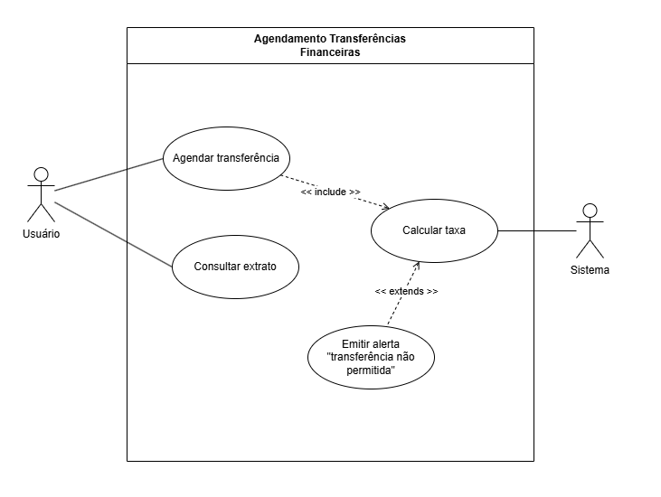
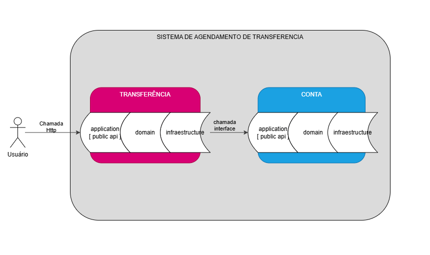
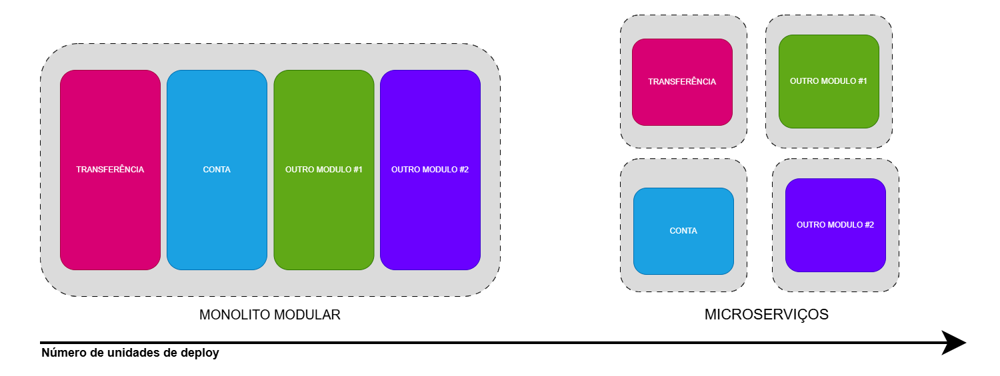
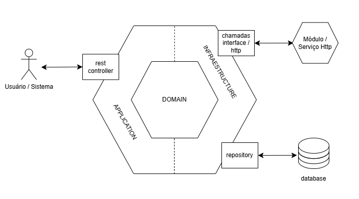

# Aplicação: Tokyo Finances
# SOBRE O PROJETO
Trata-se do desenvolvimento de um **sistema de agendamento de transferências financeiras** - **Tokyo Finances** - capaz de realizar aplicação de taxas - seguindo regras de negócio - e emitir extrato ao usuário de todos os agendamentos cadastrados.
O escopo do projeto seguira como POC (_proof of concept_), tendo como utilização banco em memória e arquitetura monolitica modular, trazendo agilidade sem perder a capacidade de crescimento futuro.

# EXECUTANDO CÓDIGO
// TODO

# REQUISITOS DO SOFTWARE
## Introdução
**Tokyo Finances**, cliente ficticio do ramo financeiro, passará a fornecer serviços de **agendamento de transferência financeira** e, para isso, demandará de uma prova de conceito para pontuar melhorias no serviço, assim como, visualização de integração na jornada do prestador em seu sistema existente.

A priori, a POC contará com serviços de agendamento e consulta a extrato de todos os agendamentos cadastrados.

Para o desenvolvimento de uma Prova de Conceito (POC - Proof of Concept) do sistema de agendamentos de transferência do _Tokyo Finances_, o princípio que norteará o desenvolvimento será o **KISS** - Keep it Simple... - tendo um enfoque em um produto minimamente utilizável, para futuramente receber iterações e melhorias.

## Personas
- Usuário: Prestador de serviços da Tokyo Finances, o qual realizará os agendamentos e poderá ver o extrado de todos os agendamentos cadastros
- Sistema: Serviço especifico ao agendamento de transferência financeira da Tokyo Finances, o qual esse documento faz referência

## Tecnologias

### Backend
- Java 11
- Springboot XXXXXX

### Banco de dados
- Memória (H2)

### Frontend
- VueJs

## Escopo
Prova de Conceito (POC), tendo como MVP o serviço de agendamento de transgerência financeira e a tela de utilização do usuário a nível de homologação.

## Requisitos Especificos
### Funcionalidade
#### 1. Agendar transferencia financeira
O usuário deve conseguir agendar transgerências financeiras, fornecendo:
- Conta de Origem
- Conta de Destino
- Valor de transferência
- Taxa aplicada
- Data da transferência
- Data de agendamento

Especificação dos termos:
- Contas: Tanto origem quanto destino, devem possuir o padrão de 10 digitos
- Data da transferência: Data a qual a transferência será realizada. Data futura.
- Data de agendamento: Data a qual o agendamento foi cadastrado. _Timestamp_

#### 2. Consultar extrato completo
O usuário deve conseguir ver o extrato de todos os agendamentos cadastrados.

#### 3. Calcular taxa
O sistema deve calcular - e aplicar - taxas seguindo as seguintes regras:
- Taxa deverá ser aplicada sobre o valor a ser transferido (Taxa sob Valor de Transferência)
- A porcentagem das taxas deve seguir a tabela de transferência

Tabela de Transferência
| Dias Transferência (De) | Dias Transferência (Até) |  Valor Mínimo (R$) | Taxa |
| :---                    | :---                     | :---               | :--- |
| 0                       | 0                        | 3,00               | 2,5% |
| 1                       | 10                       | 12,00              | 0,0% |
| 11                      | 20                       | 0,00               | 8,2% |
| 21                      | 30                       | 0,00               | 6,9% |
| 31                      | 40                       | 0,00               | 4,7% |
| 41                      | 50                       | 0,00               | 1,7% |

#### 4. Alertas sobre transferência não permitida
O sistema deverá emitir alertas ao usuário de transferência não permitida caso não haja taxa aplicável.
A transferência, então, não deverá ser realizada

### Diagrama de caso de uso

### Monolito Modular e Dominio
Para arquitetura do sistema, utilizou-se o Monolito Modular em função da agilidade na produção de uma POC, além na redução da complexidade em infraestrutura e observabilidade - consequentemente no custo do sistema - após o kickoff. Com o crescimento do projeto, aumento no numero de deploys e/ou necessidade de se trabalhar com diferentes linguagens no backend, a modularidade da arquitetura possibilitará na separação dos módulos com baixo potencial de impacto no código em execução.

Os modulos foram separados seguindo a lógica de Bounded Contexts do Domain Driven Design, sendo, para esta POC, o contexto "Agendamento" e o contexto "Conta".

## Arquitetura
### C2
#### POC
// TODO

### Hexagonal
Como arquitetura de código, optou-se pelo Hexagonal (Ports and Adapters) pelo auto nível de desacoplamento, possibilitando maior facilidade em separação dos módulos caso haja a necessiadde, protegendo a camada de dominio.

Mescla-se a estrutura hexagonal com a linguagem do Domain Driven Design pelo ganho de padronização e identificação de terminologias de negócio (linguagem ubíqua).

## Referencias
- Monolito Modular: https://www.milanjovanovic.tech/blog/what-is-a-modular-monolith
- Diagrama de caso de uso: https://medium.com/operacionalti/uml-diagrama-de-casos-de-uso-29f4358ce4d5
- Microserviços: https://microservices.io/patterns/microservices.html
- DDD: https://pablo-christian.medium.com/ddd-o-que-%C3%A9-o-domain-driven-design-de-um-jeito-simples-93ea0c9a111
- Ports and Adapters: https://www.arhohuttunen.com/hexagonal-architecture-spring-boot/
- Clean Code: MARTIN, Robert C. Clean Code: A Handbook of Agile Software Craftsmanship. 1. ed. Boston: Prentice Hall, 2008. ISBN 0132350882.